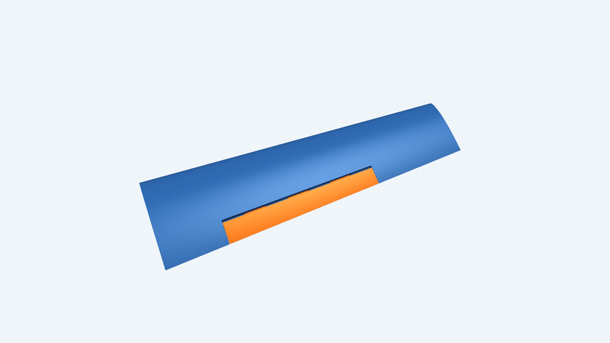
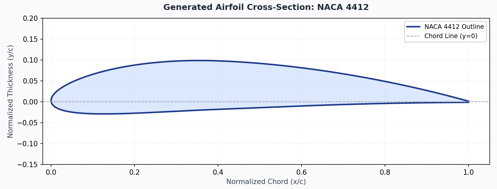
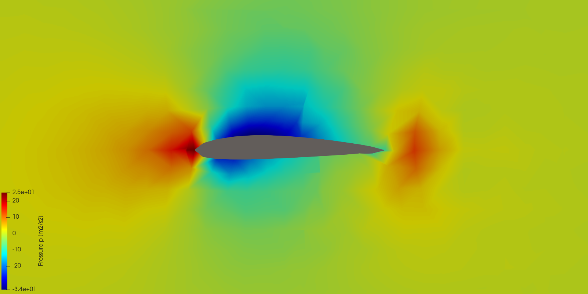
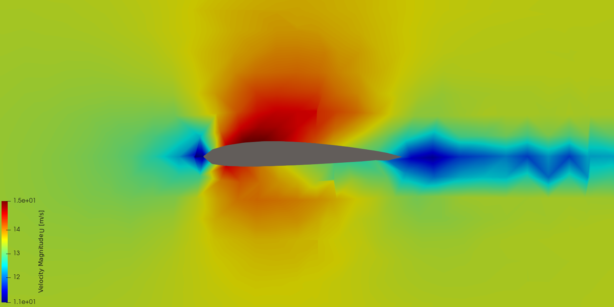

# Daedalus Thread: Mission Requirements Verification Report

**Overall Verdict**: **[SUCCESS: ALL REQUIREMENTS MET]**

---

## 1. Mission Input Parameters

The mission requirements define the operational flight envelope and constraints driving the MBSE sizing and CAD generation:

| Parameter | Input Value | Target Constraint | Description |
| :--- | :--- | :--- | :--- |
| **Cruise Airspeed Target** | `18.0 m/s` | Nominal operational cruise | Target flight airspeed for mapping/reconnaissance (~35.0 knots) |
| **Stall Speed Limit** | `<= 11.0 m/s` | Maximum allowable gross stall | Must not exceed limit to ensure low-speed safety (~21.4 knots) |
| **Payload Mass** | `1.20 kg` | Minimum payload capacity | Useful mission payload (sensor gimbal, camera, avionics) |
| **Wingspan Upper Bound** | `<= 1800.0 mm` | Maximum wingspan limit | Transport, storage, and manufacturing envelope upper bound |
| **Target Flight Duration** | `45.0 min` | Minimum operational endurance | Required on-station mission duration under cruise power |

---

## 2. Success Margins & Compliance Matrix

| Requirement Parameter | Target Limit | Achieved Value | Margin | Status | Engineering Notes |
| :--- | :--- | :--- | :--- | :--- | :--- |
| **Cruise Airspeed Target** | 18.0 m/s | 18.0 m/s | +7.0 m/s above stall | **PASS** | L/D = 19.1, CL = 0.45 |
| **Stall Speed Limit** | <= 11.0 m/s | 11.0 m/s | +0.00 m/s margin | **PASS** | Ensures clean stall margin at full gross weight |
| **Payload Mass Capacity** | >= 1.20 kg | 4.05 kg | +2.85 kg margin | **PASS** | Absolute maximum payload before stall: 6.46 kg |
| **Wingspan Upper Bound** | <= 1800.0 mm | 1552.3 mm | +247.7 mm margin | **PASS** | Bounded by transport/manufacturing limit |
| **Target Flight Duration** | >= 45.0 min | 68.6 min | +23.6 min margin | **PASS** | Battery: 0.31 kg (44.6 Wh usable) |

---

## 3. Designed Wing Specifications & Flight Performance

### 3.1 Aerodynamic Geometry
- **Airfoil Profile**: `NACA 4412`
- **Wingspan**: `1552.3 mm` (1.55 m)
- **Root Chord / Tip Chord**: `250.9 mm` / `163.1 mm`
- **Wing Surface Area (S)**: `0.3213 m^2` (3213.0 cm^2)
- **Aspect Ratio (AR)**: `7.50`
- **Taper Ratio**: `0.65`
- **Leading Edge Sweep**: `3.5 deg`
- **Dihedral Angle**: `2.0 deg`
- **Incidence Pitch Trim Angle**: `2.7 deg` (optimizes level fuselage attitude at cruise)

### 3.2 Mass & Energy Budget
- **Total Gross Aircraft Mass**: `2.95 kg` (Weight = 28.93 N)
- **Mission Payload Mass**: `1.20 kg`
- **Structural Airframe Mass**: `1.44 kg`
- **Battery Pack Mass**: `0.31 kg`
- **Usable Battery Energy**: `44.6 Wh`
- **Cruise Electrical Power**: `39.0 W`
- **Calculated Endurance**: `68.6 min`

### 3.3 Aerodynamic State at Cruise
- **Cruise Dynamic Pressure**: `198.5 Pa`
- **Required Lift Coefficient ($C_L$)**: `0.454`
- **Lift-to-Drag Ratio ($L/D$)**: `19.1`
- **Motor Thrust Power Required**: `27.3 W`

---

## 4. Generated Wing & Control Surface Visuals

### 4.1 3D CAD Wing Assembly
Isometric perspective render of the parametric wing solid (blue) with integrated aileron control surface (orange), hinge tabs, and servo pocket:

### 4.2 Airfoil Cross-Section Geometry
Normalized Selig coordinate profile for `NACA 4412`:

---

## 5. CFD Aerodynamic Simulation Cross-Sections

High-resolution mid-span fluid domain cross-sections from CfdOF / OpenFOAM simpleFoam simulation at nominal cruise velocity:

### 5.1 Air Pressure Field ($p$)
Static pressure contours across the mid-span airfoil profile showing suction peak on upper leading edge:

### 5.2 Velocity Magnitude Field ($|U|$)
Flow velocity magnitude contours showing upper surface acceleration and clean boundary layer attachment:

---

## 6. Digital Thread Artifacts & Traceability

- **Wing Main STL**: `C:\Users\kuederrj\DTC\projects\daedalus-thread\output\mission_run\wing_main.stl`
- **Wing Aileron STL**: `C:\Users\kuederrj\DTC\projects\daedalus-thread\output\mission_run\wing_aileron.stl`
- **Wing Assembly STEP**: `C:\Users\kuederrj\DTC\projects\daedalus-thread\output\mission_run\wing_assembly.step`
- **FreeCAD Document**: `C:\Users\kuederrj\DTC\projects\daedalus-thread\output\mission_run\generated_wing.FCStd`
- **Aerodynamic Report JSON**: `C:\Users\kuederrj\DTC\projects\daedalus-thread\output\mission_run\aerodynamic_report.json`
